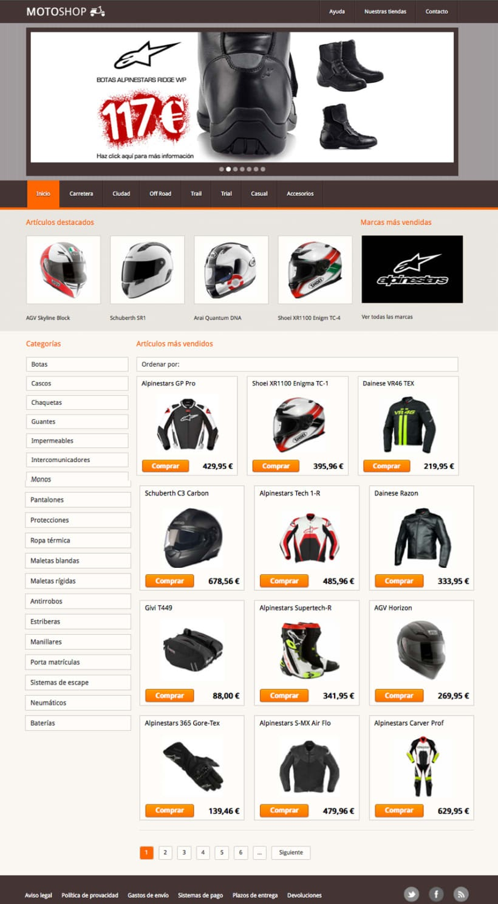

# Motoshop Landing Page

Ejercicio de maquetación para proyecto tipo e-commerce.

## Diseño 🎨

<kbd>

</kbd>

### Instalación 🔧

Puedes contar con una copia funcional del proyecto realizando los siguientes pasos.

Descarga el proyecto

```
git clone https://github.com/HectorDevx/Frontend-Excercise-3__Challenge.git
```

Instala las dependencias

```
npm install
```

Corre el proyecto

```
npm run start
```

## Construido con 🛠️

- [NPM](https://www.npmjs.com/) - Manejador de dependencias.
- [React](https://es.reactjs.org/) - Librería web utilizada.
- [Styled Components](https://styled-components.com/s://maven.apache.org/) - Framework de estilos.

## Contribuyendo 🖇️

Eres libre de aportar a este proyecto por medio de Pull Request.

## Autores ✒️

- **Gonzalo Martín Elola** - _Diseño_ - [Domestika](https://www.domestika.org/en/projects/119422-ejercicios-de-maquetacion-y-diseno-web)
- **Héctor Reyes** - _Desarrollo_ - [HéctorDevx](https://github.com/HectorDevx)

## Licencia 📄

Este proyecto está bajo la Licencia (MIT)

## Gracias 🎁

- Comenta a otros sobre este proyecto 📢
- Invitame un taquito. 🌮
- Da las gracias públicamente 🤓.

---

⌨️ con 💜 por [HéctorDevx](https://github.com/HectorDevx) 🐱‍🚀
